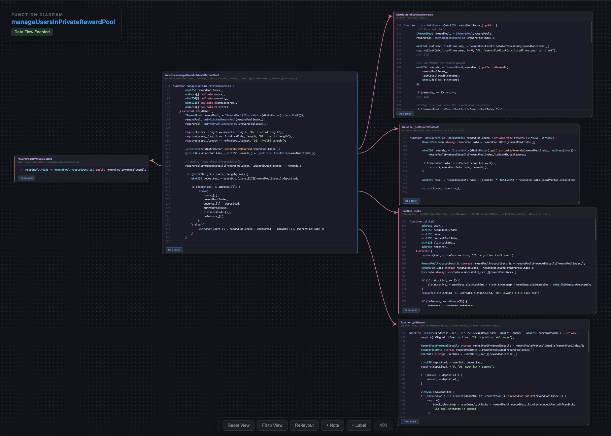

# Solidity Function Diagram

Extensión de VS Code que genera diagramas interactivos para funciones de Solidity. Haz clic derecho en una función y obtén un desglose visual de todo lo que toca.



## Qué hace

- Muestra la función con todas sus dependencias: structs, enums, variables de estado, llamadas internas.
- Resuelve llamadas de interfaz (`IERC20(token).approve()`) hacia sus implementaciones reales.
- Rastrea métodos de librería provenientes de directivas `using X for Y`.
- Dibuja flechas entre las referencias y las definiciones.

## Uso

1. Abre un archivo `.sol`
2. Haz clic derecho dentro de una función
3. Selecciona "Generate Function Diagram"

**Canvas:** Arrastra el fondo para desplazarte, usa el scroll para hacer zoom, arrastra los encabezados de los bloques para moverlos.

**Imports:** Cmd+Click (Mac) o Ctrl+Click (Windows) en cualquier función, tipo o variable para importar su definición. Funciona en todo tu espacio de trabajo y dependencias comunes (OpenZeppelin, Solmate, Solady, Forge-std).

**Data Flow:** Haz clic en "Enable Data Flow", luego haz clic en cualquier variable para ver dónde está definida, dónde se usa y hacia dónde fluye (llamadas externas, escrituras de estado, retornos).

**Notas:** Haz doble clic en el canvas para añadir anotaciones. Dibuja flechas desde las notas hacia líneas de código específicas.

## Instalación

```bash
code --install-extension solidity-diagram-0.0.1.vsix --force
```

O: Panel de extensiones → menú `...` → "Install from VSIX..."

## Desarrollo

```bash
npm install
npm run compile
```

Presiona F5 para depurar. La extensión se abrirá en una nueva ventana de VS Code.

## Licencia

MIT
